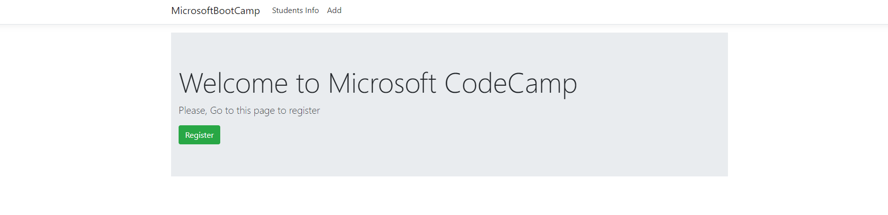
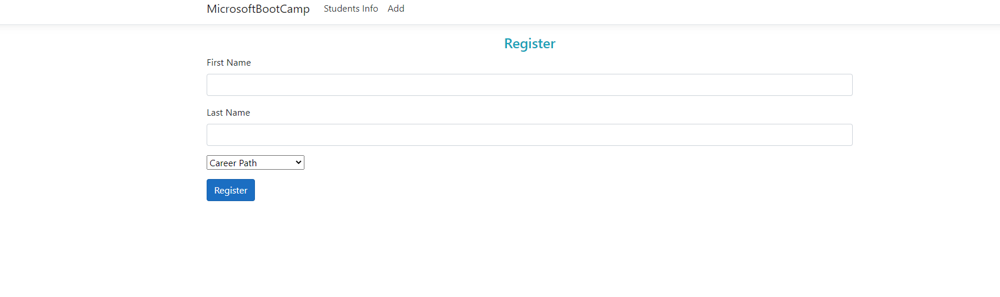
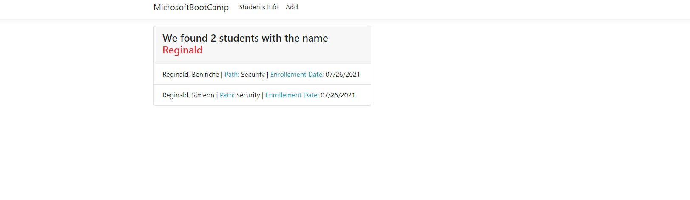
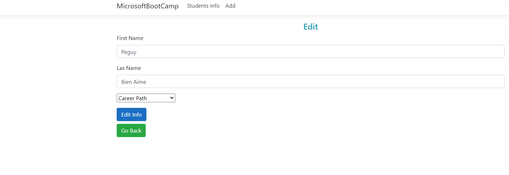
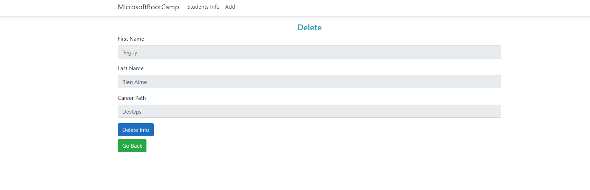

# Build a MVC App From Scratch: Welcome to Microsoft CodeCamp
For this side project you will build an MVC app from scratch. The application should render 6 views:
1. Home
2. Register
3. Add Student
4. Students Info
5. Search Results
6. Edit Student
7. Delete Student

## Base Requirements
* The site must have a navbar that routes to the `Home page`, `Add Student page`, and `Student Info page`
* Try adding some light CSS styling
  * This is a perfect chance to try out Bootstrap
* Must be a Git repository that is housed on GitHub
  * Be sure to commit often

## HomePage
On the homepage we will only have a welcome message and a link to direct the user to the register page.

## Register Page
* Users will have a form to enter `First Name`, `Last Name` and choose a `Career Path`
  * Career Paths choices are:
    * Web Development
    * Devops
    * Security
    * Machine Learning
    * Artificial Intelligence
* Once the form is submitted the user should be redirected to the `Student Info page`

## Students Info
* If there are no records the page should display a message saying to add students

* If students have been registered then the page should render:
  * A table which displays all of there information
    * You should also display two links:
      1. `Edit`: This will direct the user to the `Edit Student page`
      2. `Delete`: This will direct the user to the `Delete Student page`
  * A `search bar` that allows the user to search for a registered students by either their `First` or `Last Name`
    * The search will direct the user to the `Search Results page`

## Search Results
* Should display the number of students that are found based on the search parameter provided to the form

## Edit Student
* The page should render a form that allow the user to edit the student's record

## Delete Student
* The page should render a form that allow the user to delete the student's record

